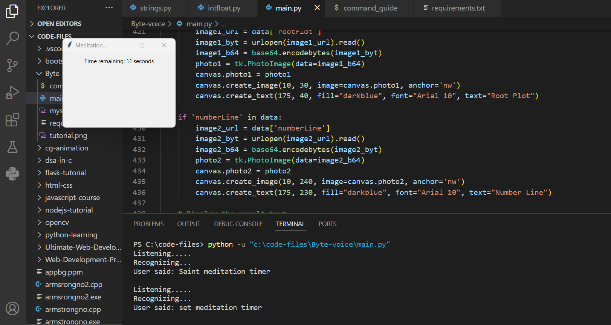
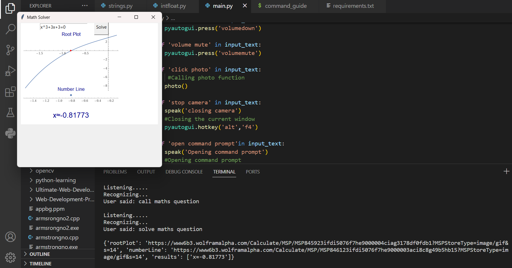
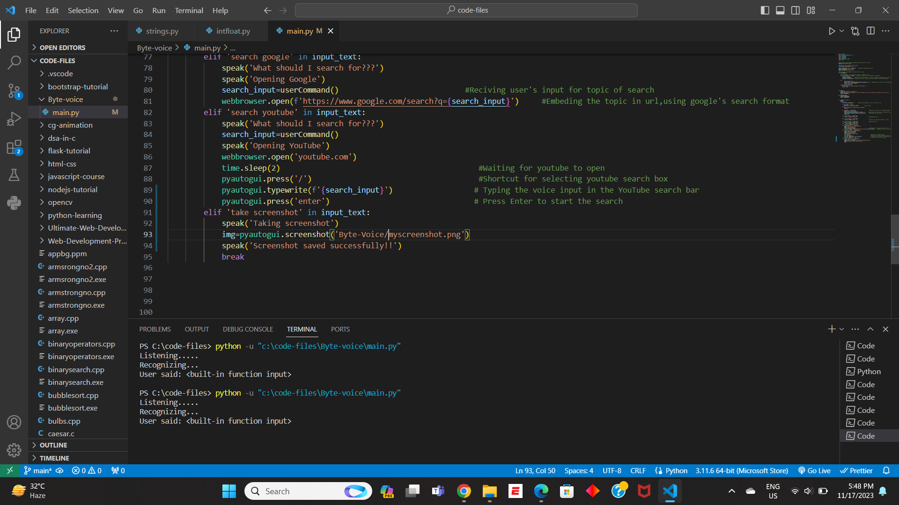
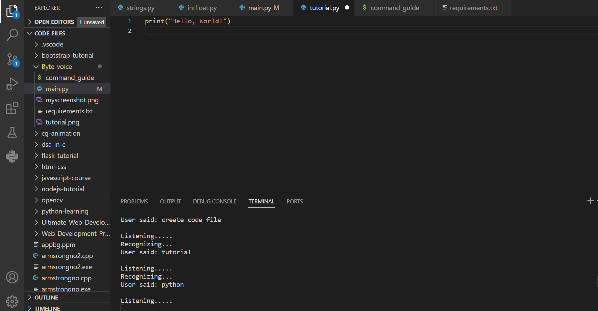

# ByteVoice

ByteVoice is python based  desktop voice assistant which is designed  to simplify and enhance your daily tasks!

The inception of ByteVoice was a eureka moment during my CS50 journey. Aiming for utility and uniqueness, ByteVoice was conceived to redefine the interaction between users and technology. As I immersed myself in the CS50 course, the quest for a meaningful and innovative final project led me to the idea of creating a voice assistant. Recognizing the vast utility of voice assistants in various contexts, I named this ambitious project "ByteVoice."

#### Video link : https://youtu.be/-j7rag-2o5I


## Activation Story
ByteVoice is not merely a voice assistant; it's an amalgamation of bytes, each contributing to the greater functionality. The inspiration behind the name stems from the project's division into manageable bytes or chunks, symbolizing the small yet powerful components that form the foundation of this intelligent system.
## Installation

* Ensure you have Python installed. You can install Python by visiting python.org.

#### Clone the Repository:

```bash
  git clone https://github.com/Shreyasb1015/ByteVoice.git
  cd ByteVoice
```


* Make sure you have install all the dependencies mentioned in the requirements.txt file.

* Here is the way to install packages metioned in the requirements.txt file.
```bash
  pip install <package-name>
```
* Run this command to execute ByteVoice
```bash
   python main.py
```

## Repository Overview

In this section,I will give you  an overview of ByteVoice repository by explaining functionality of each file.

#### Files:
***

* main.py :-This file contains the entire source code for ByteVoice. It encompasses the core functionality, voice commands, and interactions with various APIs.

* requirements.txt :-All the dependencies required to run the project are listed in this file. 

* command_guide.md :-In this guide, you'll find a detailed explanation of all the voice commands supported by ByteVoice. Each command is paired with its corresponding functionality, allowing users to navigate and utilize ByteVoice effectively.

* Images:-This folder contains images of implementation of some of my functions or commands in ByteVoice.

## Usage Guide

ByteVoice is designed to make your computer interactions seamless through voice commands. 

Below are some examples of commands you can give to ByteVoice:

| *"Click Photo"*

```bash
 User: Click Photo
```
* Functionality: Initiates the camera and captures a photo. The photo is then saved with a specified name.
| *"Take screenshot"*

```bash
 User: take screenshot
```
* Functionality: Takes the screenshot

| *"Search on YouTube"*

```bash
 User: Search on YouTube
```
* Functionality: Opens YouTube and prompts the user to specify a search query. After receiving the query, ByteVoice performs the search on YouTube.

| *"Write in notepad"*

```bash
 User: Write in notepad
```
* Functionality : Opens notepad and prompts the user to specify the note to be written in notepad and then successfully write the note given by user in notepad.


| *"Set Meditation Timer"*

```bash
 User: Set Meditation Timer
```
* Functionality: Opens a timer interface for meditation. Enter the desired meditation time in seconds and start the timer.

| *"Create Code File"*

```bash
 User: Create Code File
```
* Functionality: Guides the user through creating a new code file. Asks for the filename and the programming language, then opens a code editor with a template.

| *"Solve Maths Question"*

```bash
 User: Solve Maths Question
```
* Functionality: Opens a math visualization tool. Enter a mathematical expression, and ByteVoice will provide a visual representation along with the solution.It uses wolframalpha api--(https://products.wolframalpha.com/api)


| *"Weather Update"*

```bash
 User: Weather Update
```
* Functionality: Asks the user for their location and provides a weather update, including information like temperature, humidity, and wind speed.It uses openweathermap api --(https://openweathermap.org/api)


| *"Tell me a Joke"*

```bash
 User: Tell me a Joke
```
* Functionality: Fetches and narrates a random joke, bringing a bit of humor to your interaction with ByteVoice.It uses JokeApi--(https://sv443.net/jokeapi/v2/)

| *"Play Music"*

```bash
 User: Play Music
```
* Functionality: This command will randomly select a music file from your system's music directory and start playing it. It adds a fun and entertaining aspect to ByteVoice.


#### Note: This is just a subset of available commands. Explore the Command Guide for a comprehensive list of commands and their functionalities.
 
 
## Implementation Examples











## Experience

Working on ByteVoice has been an enriching experience that delved me deep into the realms of Python programming. This project served as a dynamic canvas to apply and sharpen my coding skills, allowing me to explore various libraries and modules, and refining my problem-solving capabilities.

One of the key takeaways from this project has been the profound importance of reading documentation. Navigating through different APIs, libraries, and understanding their functionalities has been instrumental in shaping the robust features of ByteVoice.ByteVoice has not only been a technical endeavor but also a journey that broadened my horizons of creative thinking.

This project has not just been lines of code; it's a testament to the growth and learning that comes with hands-on experience. I take pride in the development of ByteVoice, and it stands as a milestone in my programming journey. I'm excited about the potential for further enhancements and additions, and I look forward to the continued evolution of ByteVoice.


## Contributions

ByteVoice is a solo project, and all contributions are welcomed through suggestions, bug reports, or feature requests. Feel free to open issues or reach out with ideas for improvement. Your feedback is invaluable and contributes to the ongoing refinement of ByteVoice.l


## Echoes of Power

In the silence of bytes, where whispers linger, there emerges a force that transcends mere code interpretation. Bytes whisper, but when harnessed by *ByteVoice*, they transform into a resounding roar.

**Bytes whisper, ByteVoice roars.**

